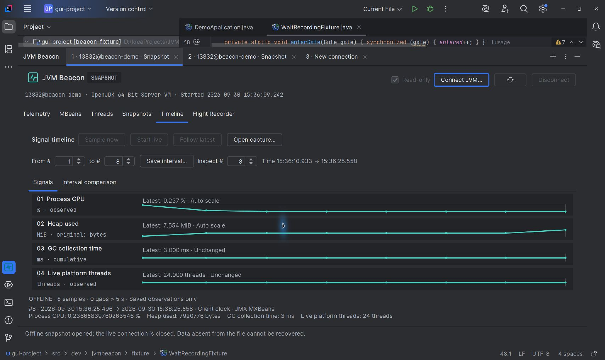
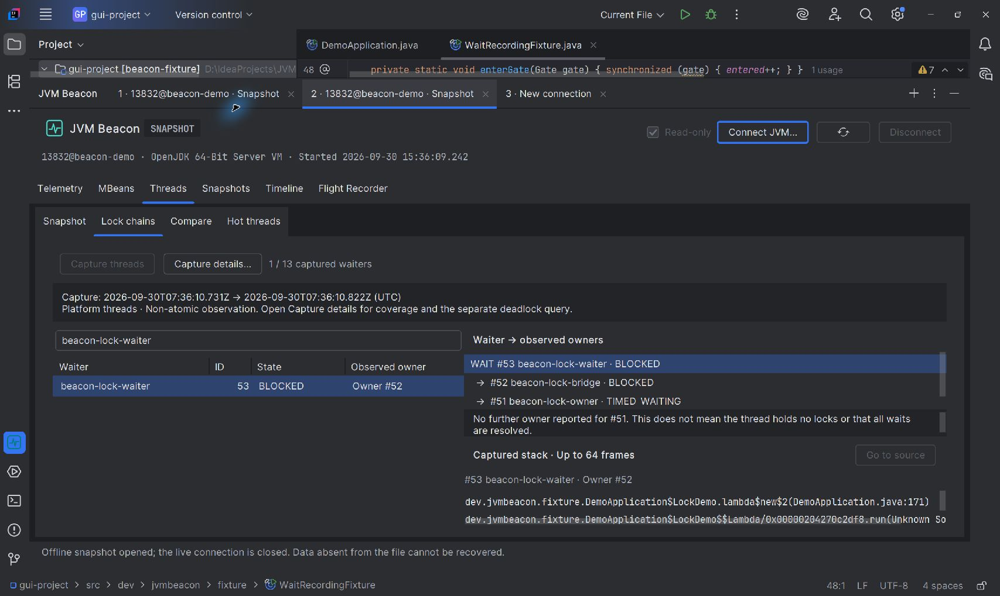
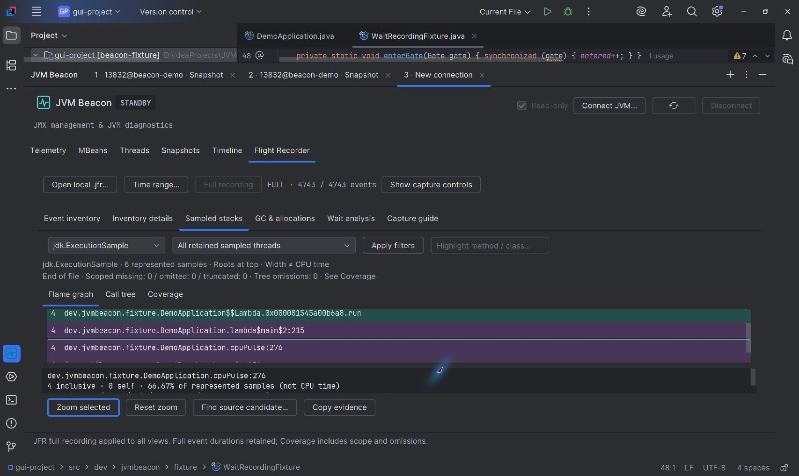
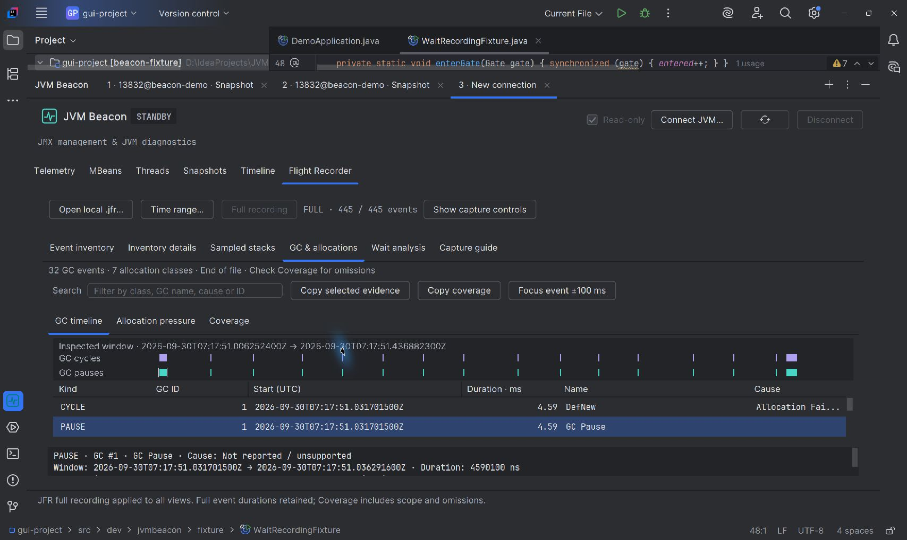
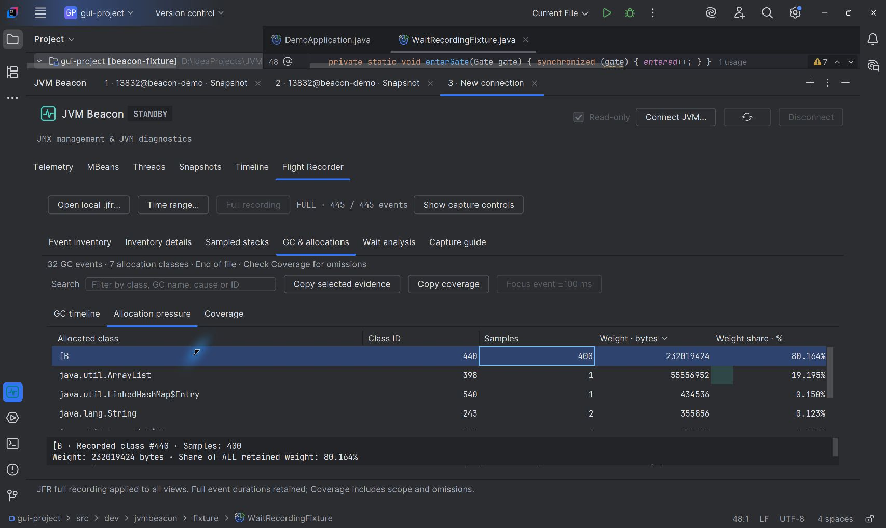
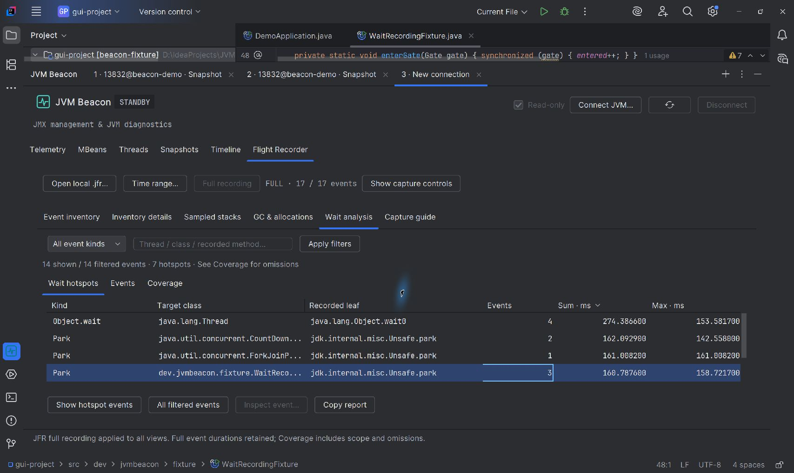

# JVM Beacon · 真实发布截图

采集日期 **2026-09-30**。六张 PNG 均为最终 **1.0.0-rc.2** 在官方完整 IntelliJ IDEA Community **2025.1.3 / JBR 21 / Windows** 中实际显示的界面，原生 Dark 主题、系统缩放 125%，统一原始尺寸 **1707×1019**。没有合成面板、假数据、裁剪、放大、遮盖状态或后期修图。截图包含自有测试项目，未连接业务进程；原始诊断文件不随发布素材分发。

安装 ZIP SHA-256：`2cde88b40c4da2037a1780b3474bdadc9a3354fda73a68e9c05a4b8df90dfccc`。实际加载 JAR：`adba2ca07218027783383a9f9b4018c2f7902db0e3111d46498f63837e507071`，与 ZIP 内一致。

## 上传顺序与英文说明

| 文件 | Caption | 画面中的真实证据 |
|---|---|---|
| [01-timeline.png](01-timeline.png) | Keep runtime signals together. Reopen eight real metric samples with original units, collection windows and explicit offline status. | 8 个真实样本、0 个超过 5 秒的空档；原始采集窗口与 OFFLINE 状态可见 |
| [02-lock-chains.png](02-lock-chains.png) | Follow reported lock owners. Inspect a captured waiter to bridge to owner chain without rereading the target. | #53 waiter → #52 bridge → #51 owner；原始平台线程栈与 owner 边界可见 |
| [03-jfr-stacks.png](03-jfr-stacks.png) | Read recorded stack evidence. Zoom a sample-count flame graph and inspect cpuPulse; widths and shares are not CPU time. | 6 个 ExecutionSample；缩放真实分支后 cpuPulse 的 4 个 inclusive samples，份额分母不变 |
| [04-jfr-memory.png](04-jfr-memory.png) | Separate GC cycles from pauses. Inspect a recorded pause with its exact UTC window and duration. | GC 周期/顶层暂停分开；选中暂停为 4,590,100 ns，原始 UTC 窗口可见 |
| [05-jfr-allocations.png](05-jfr-allocations.png) | Find allocation pressure. Compare retained sample weights by recorded class; shares are not live-heap percentages. | 7 个保留类；byte[] 400 个样本，记录权重 232,019,424 bytes，80.164% |
| [06-jfr-waits.png](06-jfr-waits.png) | Explore recorded waits. Compare monitor and park hotspots with event counts and durations; overlapping waits are not a pause rate. | 14 个受支持等待事件、7 个热点；monitor/park 的数量与时长分别显示 |













## 状态和解释边界

前两张重新打开真实 `.jvmb` 文件，明确是离线现场；后三类 JFR 画面来自真实文件，连接状态为 STANDBY。没有把离线画面标为 LIVE，也没有把这组截图宣称为实时远程连接演示。品牌 SVG/PNG 是原创设计，放在独立 `brand/` 目录，不是产品截图。

线程链只沿已报告 owner ID，平台线程快照不覆盖虚拟线程；没有后续 owner 不表示所有锁已释放。火焰图是保留样本计数，不能当 CPU 时间或根因；录制时长短，样本少，适合展示交互，不是性能基准。分配权重不是活跃堆大小；GC 周期不等于暂停；跨线程等待可重叠，累计等待不能当暂停率。测试录制中的自定义边界事件未被错误归入标准 GC/分配/等待分析。

专用 fixture 的 `--public-demo` 只把 Runtime.Name 的主机部分报告成 `beacon-demo`，PID、启动时间、指标、线程、MBean 调用和权限均真实。插件未修改目标标识，图片也未后期改字；该显式别名不能用来宣称目标已经认证或匿名化。

本轮没有完成实时认证 GUI 接管，故没有用旧版 MBean 写入/操作截图冒充 rc.2。源码导航、全部筛选/失败组合、Ultimate GUI、多缩放与长时压力也不是这组截图的验收范围。完整结果在私有项目 `docs/gui-validation.md` 中分版本记录。

## 复现与来源

私有工作区设置 JDK 21 后，可重新生成独立、有时限、自动清理的真实文件：

```powershell
.\scripts\capture-marketplace-demo.ps1 -JdkHome '<JDK21目录>'
.\scripts\capture-jfr-demo.ps1 -JdkHome '<JDK21目录>'
.\scripts\capture-memory-demo.ps1 -JdkHome '<JDK21目录>'
.\scripts\capture-waits-demo.ps1 -JdkHome '<JDK21目录>'
```

每次生成新的时间戳目录；在最终安装包中用 Snapshots / Open… 打开 Timeline、locks-A，用 Flight Recorder / Open recording… 打开三种录制，再按上述顺序实际操作和截图。实时连接另用 `run-marketplace-demo.ps1`，必须由人输入临时密码；脚本只开放认证 loopback，不作为用户正常使用的依赖。

私有源仓库 `media/manifest.json` 保留版本、逐图 SHA-256、原始 capture 来源、最终包/JAR 摘要和空 transforms 列表；六张公开 PNG 与原图逐字节相同。原图、日志、录制与快照在忽略的 `build/` 内，未推送或加入材料 ZIP。材料 ZIP 中的 `media/screenshots.json` 仅保留公开图的文件、尺寸、摘要、caption 和安装包摘要，移除原图路径；它不是可替代源 provenance 的记录。新克隆工作区需重新构建、检查和采集，不能从缺失的 build 文件推断验收通过。
